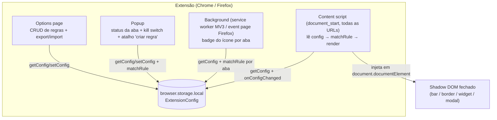
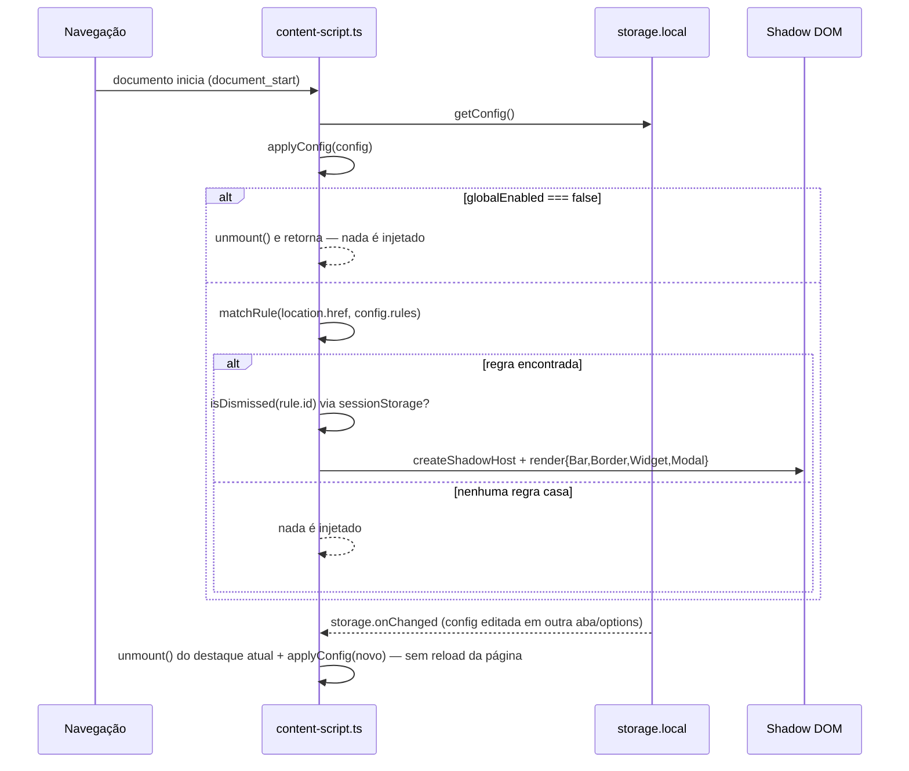

# Arquitetura — URL Highlighter

> Documentação técnica do repositório, para quem for dar manutenção ou estender a extensão. Para instalação e uso, ver [README.md](README.md). Este documento reflete o **código atual** (não o plano original) — a proposta de arquitetura e o histórico de etapas de implementação usados no planejamento inicial ficam em notas pessoais fora deste repositório.

## 1. O que a extensão faz

Extensão de navegador (Chrome + Firefox, Manifest V3) que destaca visualmente uma página com base em regras configuráveis de match contra a URL — útil para distinguir staging de produção, sinalizar painéis administrativos ou qualquer ambiente sensível sem depender de o usuário conferir a URL manualmente. É puramente um destaque visual sobreposto: nunca bloqueia, redireciona ou modifica o conteúdo/funcionamento da página (exceto o `modal`, que bloqueia interação por design até ser fechado — ver §4).

Não sincroniza regras automaticamente entre pessoas/navegadores — compartilhamento é manual via export/import de JSON (§6).

## 2. Decisões-chave

| Decisão | Por quê |
|:--|:--|
| **Manifest V3** nos dois browsers | Caminho atual de Chrome e Firefox (109+); evita manter duas gerações de manifesto |
| **`webextension-polyfill`** como única API usada (nunca `chrome.*` direto) | API baseada em Promise, mesmo código roda nos dois browsers |
| **Matching por wildcard/glob simples, não regex** | Configurável por qualquer pessoa do time sem saber regex |
| **Config local (`storage.local`) + export/import manual (JSON)** | Sem infra de sincronização; compartilhar regras é um ato deliberado, não automático |
| **Content script decide sozinho** (lê config, casa regra, renderiza) — sem round-trip pro background | Minimiza latência até o destaque aparecer na primeira pintura da página |
| **Shadow DOM fechado (`mode: "closed"`)** para o destaque | Isola CSS/JS do host da página nos dois sentidos |
| **Menor `priority` vence** entre regras habilitadas que casam a mesma URL | Evita ambiguidade; desempate por ordem no array (sort estável) |
| **Ícone é um conjunto fechado de 5 valores semânticos** (`alerta`, `informacao`, `nota`, `perigo`, `sucesso`) | Consistência visual; nunca texto livre ou emoji picker |

## 3. Diagrama de componentes



O background nunca é chamado pelo content script para decidir o destaque — ele só atualiza o badge da toolbar (§5) e serve o popup. `getConfig`/`setConfig`/`onConfigChanged` (`src/shared/storage.ts`) e `matchRule` (`src/shared/rule-matcher.ts`) são os mesmos módulos puros reaproveitados nos quatro contextos (content script, popup, background, options).

## 4. Modelo de dados

`src/shared/types.ts`:

```ts
export type HighlightIcon = 'alerta' | 'informacao' | 'nota' | 'perigo' | 'sucesso';

export interface HighlightRule {
  id: string;
  name: string;
  enabled: boolean;
  urlPattern: string;       // glob, ex. "*://staging.*.example.com/*"
  priority: number;         // menor = maior prioridade; desempate = ordem no array
  highlight: {
    type: 'bar' | 'border' | 'widget' | 'modal';
    color: string;          // hex
    message?: string;       // obrigatório para bar/widget/modal
    icon?: HighlightIcon;   // não usado por "border"
    position?: 'top' | 'bottom'; // "bar": topo/rodapé; "widget": canto (topo/rodapé), direita fixa
    dismissible?: boolean;  // aplicável a bar/widget/modal; default true
  };
}

export interface ExtensionConfig {
  schemaVersion: number;
  globalEnabled: boolean;   // kill switch geral (popup)
  rules: HighlightRule[];
}
```

`src/shared/storage.ts` expõe o único ponto de acesso a `browser.storage.local`:

- `getConfig()` — lê a chave `"config"`, retorna `DEFAULT_CONFIG` (`{ schemaVersion: 1, globalEnabled: true, rules: [] }`) se ausente.
- `setConfig(config)` — grava.
- `onConfigChanged(callback)` — assina `storage.onChanged`, filtra `areaName === "local"` e a chave `config`.
- `seedDefaultConfigIfEmpty()` — só grava o default se a chave ainda não existir; chamado em `runtime.onInstalled` no background.

O background expõe um hook de depuração em `self.__uh` (`getConfig`, `setConfig`, `DEFAULT_CONFIG`), útil pra inspecionar/editar config direto pelo console do service worker.

## 5. Matching (`shared/glob.ts` + `shared/rule-matcher.ts`)

Funções puras, sem dependência de API de browser — cobertas por `vitest` (`src/shared/__tests__/`).

```ts
// glob.ts — converte glob em regex case-insensitive
export function globToRegExp(pattern: string): RegExp {
  const escaped = pattern.replace(/[.+^${}()|[\]\\]/g, '\\$&');
  const withWildcards = escaped.replace(/\*/g, '.*').replace(/\?/g, '.');
  return new RegExp(`^${withWildcards}$`, 'i');
}

// rule-matcher.ts — regra vencedora entre as habilitadas, por menor priority
export function matchRule(url: string, rules: HighlightRule[]): HighlightRule | null {
  const candidates = rules.filter((r) => r.enabled).sort((a, b) => a.priority - b.priority);
  for (const rule of candidates) {
    if (globToRegExp(rule.urlPattern).test(url)) return rule;
  }
  return null;
}
```

`*` casa qualquer sequência (inclusive vazia, inclusive atravessando `/`); `?` casa um caractere. Sem tratamento especial de `**` (duas sequências de `.*` já produzem o mesmo efeito).

## 6. Content script — fluxo de matching e renderização

`src/content/content-script.ts` roda em `document_start`, em todas as URLs (`<all_urls>`):



Pontos de implementação (`content-script.ts`):

- `currentShadow`/`currentCleanup` no escopo do módulo guardam o destaque montado, para permitir `unmount()` limpo a cada mudança de config (via `onConfigChanged`) — nunca acumula mais de um shadow host.
- `unmount()` chama o `cleanup` retornado pelo renderizador (hoje só `renderBar` retorna um — remove o `ResizeObserver` e o padding do `<html>`) e remove o host da árvore real.
- Dismiss (`bar`/`widget`/`modal`) é checado **antes** de montar: `isDismissed(rule.id)` lê `sessionStorage['__uh_dismissed_' + ruleId]` (`src/content/render/mount.ts`). `border` nunca é dismissível.

## 7. Renderização — os 4 tipos (`src/content/render/`)

Todos usam `createShadowHost(id)` (`mount.ts`): cria um `<div>` com `style.all = "initial"`, anexado a `document.documentElement`, e retorna um shadow root `mode: "closed"` — isolamento total de CSS/JS do host.

| Tipo | Arquivo | Comportamento | `pointer-events` | Ícone |
|:--|:--|:--|:--|:--|
| `bar` | `bar.ts` | Faixa fixa (topo/rodapé via `position`), `z-index: 2147483647`. **Empurra o conteúdo real** via `padding-top`/`padding-bottom` no `<html>`, medido com `ResizeObserver` (recalcula em resize/wrap) | `none` no wrapper; `auto` só no botão de fechar (se `dismissible`) | sim |
| `border` | `border.ts` | `<div>` fixo cobrindo a viewport (`inset: 0`), `box-shadow: inset 0 0 0 6px <color>`, sem texto | `none` — sinal puramente periférico | não |
| `widget` | `widget.ts` | Badge fixa num canto (`position` define topo/rodapé; direita é fixa), clique expande/recolhe a mensagem completa | `auto` só na própria badge (não cobre a viewport) | sim |
| `modal` | `modal.ts` | Backdrop cobrindo a viewport inteira, caixa central com mensagem + botão "Fechar" | `auto` no backdrop inteiro — **único tipo intencionalmente bloqueante** | sim |

`icons.ts` resolve `HighlightIcon → browser.runtime.getURL('icons/highlight/<nome>.svg')` e monta um ``; os 5 SVGs são declarados em `web_accessible_resources` no manifest (necessário porque são carregados de dentro do shadow DOM da página visitada, não da extensão). A arte final (Material Design Icons) já substituiu os placeholders originais.

**Persistência do dismiss:** fechar `bar`/`widget`/`modal` chama `markDismissed(ruleId)` (grava `sessionStorage`) — não reaparece na mesma aba/sessão, reaparece em aba nova ou após reinício do navegador.

## 8. Popup (`src/popup/`)

`popup.ts` roda no popup da toolbar, sem acesso ao content script da aba:

1. `browser.tabs.query({ active: true, currentWindow: true })` pega a URL da aba ativa.
2. `getConfig()` + `matchRule(activeTabUrl, config.rules)` (os mesmos módulos puros do content script) decidem o que mostrar: "Highlights desativados globalmente" | "Nenhum destaque ativo para essa página" | nome + swatch da regra vencedora.
3. Toggle liga/desliga `globalEnabled` (kill switch geral) — grava via `setConfig`; a propagação para o content script já aberto acontece via `onConfigChanged` (§6), sem reload.
4. "Criar regra para esta URL": monta `*://<hostname>/*` a partir da URL da aba e abre `options.html?prefillPattern=<pattern>` em nova aba (`browser.tabs.create`, não `runtime.openOptionsPage` — que não repassa query string de forma confiável entre browsers).
5. "Abrir configurações completas": `browser.runtime.openOptionsPage()`.

Também guarda preferência de tema (claro/escuro) em `localStorage['uh_theme']`, com fallback para `prefers-color-scheme`.

## 9. Options page (`src/options/options.ts`, ~530 linhas)

CRUD completo de regras, sem framework (DOM API vanilla). Funções principais:

- `renderRules(config)` — re-renderiza toda a listagem a partir do config salvo (nunca de estado local solto); assina `onConfigChanged` para refletir edições feitas em outra aba de Opções aberta.
- `startEdit(rule)` / `resetForm()` — alternam o formulário entre modo criação e edição.
- `updateFieldVisibility(type)` — mostra/esconde campos conforme `highlight.type` (ex. `message`/`icon` ocultos para `border`; `position` só para `bar`/`widget`; `dismissible` só para `widget`/`modal`).
- `toggleEnabled` / `deleteRule` / `moveRule(id, 'up' | 'down')` — cada mutação lê `getConfig()`, aplica a mudança no array `rules` e grava com `setConfig()`. `moveRule` troca `priority` com a regra vizinha na lista ordenada.
- `openDeleteModal`/`closeDeleteModal` — confirmação de exclusão via modal próprio (não `confirm()` nativo).
- `validateConfigShape(data)` — valida a shape mínima de um JSON importado antes de aceitar.
- Prefill via query string: `?prefillPattern=<pattern>` (vindo do popup) preenche `urlPattern` no formulário de nova regra sem salvar automaticamente.

**Validação ao salvar:** `name` e `urlPattern` não vazios; `message` obrigatório para `bar`/`widget`/`modal`; `icon` sempre via `<select>` das 5 opções fixas, nunca texto livre; `urlPattern === "*"` gera aviso não-bloqueante (continua salvável).

O visual da página (e do popup, que replica o mesmo padrão — commits `e1f8f5f`/`0389e12`) foi portado de um protótipo gerado no Figma Make para DOM vanilla, mantendo a mesma lógica de CRUD.

## 10. Export / Import (dentro de `options.ts`)

- **Exportar:** `new Blob([JSON.stringify(await getConfig(), null, 2)])` → `<a download="url-highlighter-config.json">` temporário com `URL.createObjectURL`.
- **Importar:** `<input type="file">` oculto → `FileReader` → `JSON.parse` → `validateConfigShape` (rejeita e mostra erro sem alterar o config atual se a shape for inválida) → `confirm()` nativo do browser avisando quantas regras serão substituídas → `setConfig(novoConfig)`.

Decisão de arquitetura: **não há sync automático** entre pessoas/navegadores — é um ato manual, deliberado (ver §2).

## 11. Background (`src/background/service-worker.ts`)

Dois papéis, nenhum deles no caminho crítico da renderização do destaque:

1. **Seed inicial:** `runtime.onInstalled` chama `seedDefaultConfigIfEmpty()` e loga o config atual.
2. **Badge da toolbar por aba** (`updateBadgeForTab`): se a URL não é `http(s)`, limpa o badge; senão lê `getConfig()`, roda `matchRule` (só se `globalEnabled`) e seta `action.setBadgeBackgroundColor` + `setBadgeText('●')` se houver regra vencedora, senão limpa. Disparado por `tabs.onUpdated` (status `"complete"`), `tabs.onActivated` e `onConfigChanged` (recalcula **todas** as abas abertas quando a config muda, ex. cor de uma regra editada).

`browser.action.*` (via polyfill) unifica `action`/`browserAction` entre Chrome e Firefox.

## 12. Build e compatibilidade cross-browser

`scripts/build.mjs` (Node ESM puro, sem TS) recebe `chrome` ou `firefox`:

1. Limpa/recria `dist/<browser>/`.
2. `esbuild` bundla 4 entrypoints (`background`, `content-script`, `popup`, `options`) em IIFE, `target: es2020`, um arquivo por entry.
3. Copia `popup.{html,css}`, `options.{html,css}` e a pasta `icons/` inteira para `dist/<browser>/`.
4. Lê `manifest.template.json` (campos comuns) e faz merge com overrides por browser:
   - **Chrome:** `{ background: { service_worker: "background.js" } }`.
   - **Firefox:** `{ background: { scripts: ["background.js"] }, browser_specific_settings: { gecko: { id: "url-highlighter@example.org" } } }`.
5. Escreve `dist/<browser>/manifest.json`.

`npm run build` roda os dois. `manifest.template.json` hoje está em `1.0.0`, com `permissions: ["storage", "activeTab"]`, `host_permissions: ["<all_urls>"]` e `web_accessible_resources` para os SVGs de `icons/highlight/`.

`tsc --noEmit` (`npm run typecheck`) só type-checa — a transpilação real é do esbuild.

> **Chrome via Flatpak:** se o Chrome do ambiente de dev roda em sandbox Flatpak, arquivos novos adicionados a `dist/chrome` (ex. novo ícone) podem não aparecer só com "reload" da extensão — é necessário remover e recarregar (novo diálogo de seleção de pasta) porque o portal `xdg-desktop-portal` não repropaga a pasta já concedida automaticamente.

## 13. Testes

`vitest` cobre só a lógica pura e determinística — sem API de browser:

- `src/shared/__tests__/glob.test.ts` — casos de borda de `globToRegExp` (wildcard de porta, hostname, `?`, case-insensitive).
- `src/shared/__tests__/rule-matcher.test.ts` — prioridade, desempate por ordem, `enabled: false` ignorado, lista vazia, nenhum match.

`npm test` roda tudo. Não há teste automatizado para renderização (Shadow DOM), storage ou UI — validação desses fluxos é manual, nos dois browsers (ver README e critérios de aceitação no histórico de arquitetura no vault).

## 14. Estrutura de pastas

```
url-highlighter/
├── manifest.template.json
├── scripts/build.mjs
├── src/
│   ├── background/service-worker.ts
│   ├── content/
│   │   ├── content-script.ts
│   │   └── render/{mount,bar,border,widget,modal,icons}.ts
│   ├── popup/{popup.html,popup.ts,popup.css}
│   ├── options/{options.html,options.ts,options.css}
│   └── shared/
│       ├── types.ts
│       ├── storage.ts
│       ├── rule-matcher.ts
│       ├── glob.ts
│       └── __tests__/{glob,rule-matcher}.test.ts
├── icons/
│   ├── toolbar/{16,32,48,128}.png, icon.svg   # ícone final da extensão na toolbar
│   └── highlight/{alerta,informacao,nota,perigo,sucesso}.svg  # os 5 ícones semânticos
├── package.json / tsconfig.json
└── README.md
```

## 15. Limitações conhecidas / fora de escopo

- Sem sincronização automática de regras entre pessoas/navegadores (decisão consciente, §2/§10).
- Sem publicação em loja (Chrome Web Store/AMO) — distribuição é interna via arquivo compartilhado (`.zip`/`.xpi`), decisão registrada no README.
- Sem teste automatizado de renderização/Shadow DOM/UI — só a camada pura (`glob`/`rule-matcher`) tem cobertura de `vitest`.
- `z-index: 2147483647` (máximo i32) reduz mas não elimina o risco de um site com `z-index` extremo competir visualmente com o destaque.
